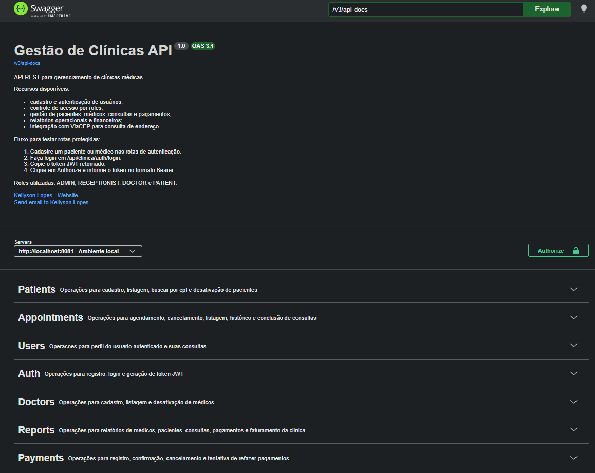

# Gestão de Clínicas API

API REST para gerenciamento de clínicas médicas, desenvolvida com Java 21, Spring Boot, PostgreSQL e autenticação JWT.

O projeto foi construído para praticar backend em um cenário próximo de uma aplicação real: cadastro de usuários, pacientes e médicos, agendamento de consultas, pagamentos, relatórios operacionais/financeiros, consumo de API externa, controle de acesso por perfil e documentação interativa com Swagger/OpenAPI.

# Swagger


## Status do projeto

Em desenvolvimento, com as principais regras de negócio da API já implementadas.

Atualmente o projeto possui:

- API REST com arquitetura em camadas
- Autenticação stateless com JWT
- Autorização por roles
- Integração com a API ViaCEP para consulta de endereço
- Migrations de banco com Flyway
- Documentação interativa com Swagger/OpenAPI
- Pipeline de CI com GitHub Actions
- Build e testes automatizados com Maven no CI
- Banco PostgreSQL usado no ambiente de CI

## Funcionalidades

### Autenticação e usuários

- Cadastro de paciente
- Cadastro de médico
- Login com geração de token JWT
- Consulta do perfil do usuário autenticado
- Rotas específicas para paciente e médico autenticados
- Controle de acesso por perfil:
  - `ADMIN`
  - `RECEPTIONIST`
  - `DOCTOR`
  - `PATIENT`

### Pacientes

- Cadastro de pacientes
- Listagem paginada
- Filtros dinâmicos por nome, cidade, estado e data de nascimento
- Busca por CPF
- Desativação com soft delete
- Consulta de endereço via ViaCEP

### Médicos

- Cadastro de médicos
- Listagem paginada
- Filtros dinâmicos por nome, UF do CRM e especialidade
- Desativação com soft delete
- Validação de CRM único

### Consultas

- Agendamento de consultas
- Cancelamento de consultas
- Finalização de consultas
- Listagem por período
- Listagem de consultas do dia
- Listagem de consultas agendadas por paciente
- Histórico de consultas por paciente
- Listagem de consultas agendadas por médico
- Histórico de consultas por médico

### Pagamentos

- Registro de pagamentos
- Confirmação de pagamentos pendentes
- Cancelamento de pagamentos
- Nova tentativa de pagamento cancelado

### Relatórios

- Top 10 médicos com mais consultas realizadas
- Médicos sem consultas canceladas
- Próximas 30 consultas de um médico
- Pacientes com pagamentos pendentes
- Top 5 médicos por faturamento
- Faturamento anual da clínica
- Médicos com maior número de consultas canceladas

## Tecnologias utilizadas

- Java 21
- Spring Boot
- Spring MVC
- Spring Security
- Spring Data JPA
- Hibernate
- PostgreSQL
- Flyway
- Bean Validation
- Lombok
- Maven
- JWT
- Swagger/OpenAPI
- RestClient
- GitHub Actions

## Conceitos aplicados

- Arquitetura em camadas
- Controllers, Services, Repositories, DTOs e Mappers
- Validação com `@Valid`
- Tratamento global de exceções
- Autenticação e autorização com Spring Security
- Relacionamentos JPA
- Paginação com `Pageable`
- Filtros dinâmicos com Specification
- Transações com `@Transactional`
- Soft delete
- Queries com Spring Data JPA e JPQL
- Projeções com DTOs para relatórios
- Versionamento de banco com Flyway
- Consumo de API externa com timeout configurado
- Integração contínua com GitHub Actions

## Documentação da API

A documentação interativa está disponível pelo Swagger UI.

Depois de iniciar a aplicação, acesse:

```text
http://localhost:8081/swagger-ui/index.html
```

Fluxo recomendado para testar no Swagger:

1. Cadastre um paciente ou médico em `/api/clinica/auth/register/patient` ou `/api/clinica/auth/register/doctor`.
2. Faça login em `/api/clinica/auth/login`.
3. Copie o token JWT retornado.
4. Clique em **Authorize** no Swagger.
5. Informe o token no formato:

```text
Bearer seu_token_jwt
```

## Principais rotas

| Recurso | Base path |
| --- | --- |
| Autenticação | `/api/clinica/auth` |
| Usuários | `/api/clinica/users` |
| Pacientes | `/api/clinica/patients` |
| Médicos | `/api/clinica/doctors` |
| Consultas | `/api/clinica/appointments` |
| Pagamentos | `/api/clinica/payments` |
| Relatórios | `/api/clinica/reports` |

## CI

O projeto possui pipeline de integração contínua com GitHub Actions.

O workflow executa em pushes para `main`, `feature/**`, `fix/**`, `refactor/**` e `hotfix/**`, além de pull requests para `main`.

Etapas executadas:

- Checkout do código
- Configuração do Java 21
- Inicialização de um serviço PostgreSQL 16
- Configuração das variáveis de ambiente da aplicação
- Execução de build e testes com:

```bash
./mvnw clean verify
```

## Como executar localmente

### Pré-requisitos

- Java 21
- PostgreSQL
- Maven Wrapper já incluído no projeto

### Variáveis de ambiente

Configure as variáveis usadas pelo `application.yaml`:

```text
DB_URL=jdbc:postgresql://localhost:5432/nome_do_banco
DB_USERNAME=seu_usuario
DB_PASSWORD=sua_senha
JWT_SECRET_KEY=sua_chave_secreta_com_tamanho_seguro
```

### Executar a aplicação

No Windows:

```bash
./mvnw.cmd spring-boot:run
```

No Linux/macOS:

```bash
./mvnw spring-boot:run
```

A API será iniciada em:

```text
http://localhost:8081
```

## Estrutura do projeto

```text
src/main/java
└── com/kellyson/gestaodeclinicasapi/gestao_de_clinicas_api
    ├── config
    ├── controller
    ├── doc
    ├── dto
    ├── entity
    ├── enums
    ├── exception
    ├── mapper
    ├── repository
    ├── service
    └── specification
```

## Autor

Kellyson Lopes

- GitHub: [kellyson04](https://github.com/kellyson04)
- Email: kellysonlopes04@outlook.com
